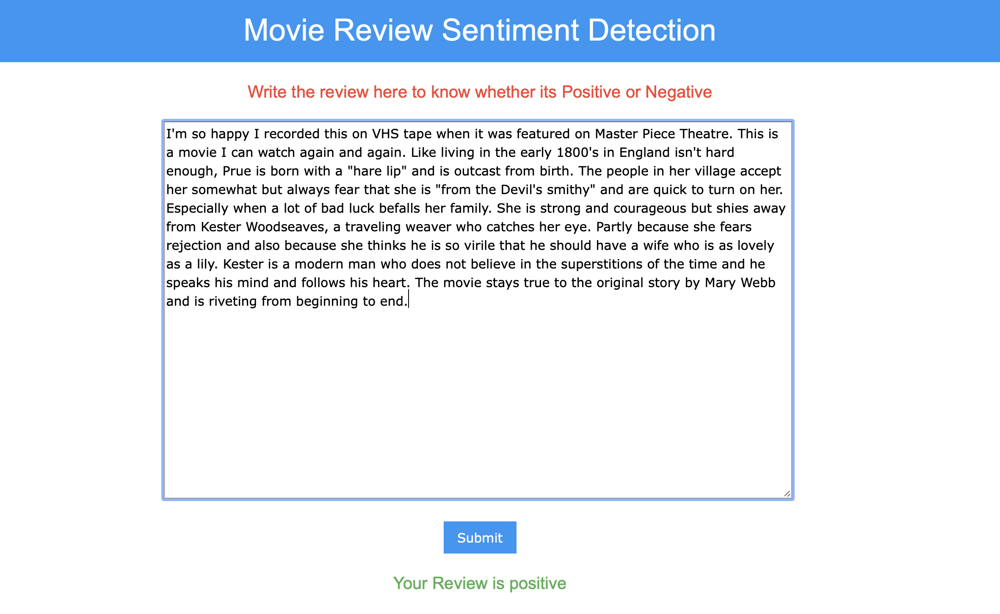
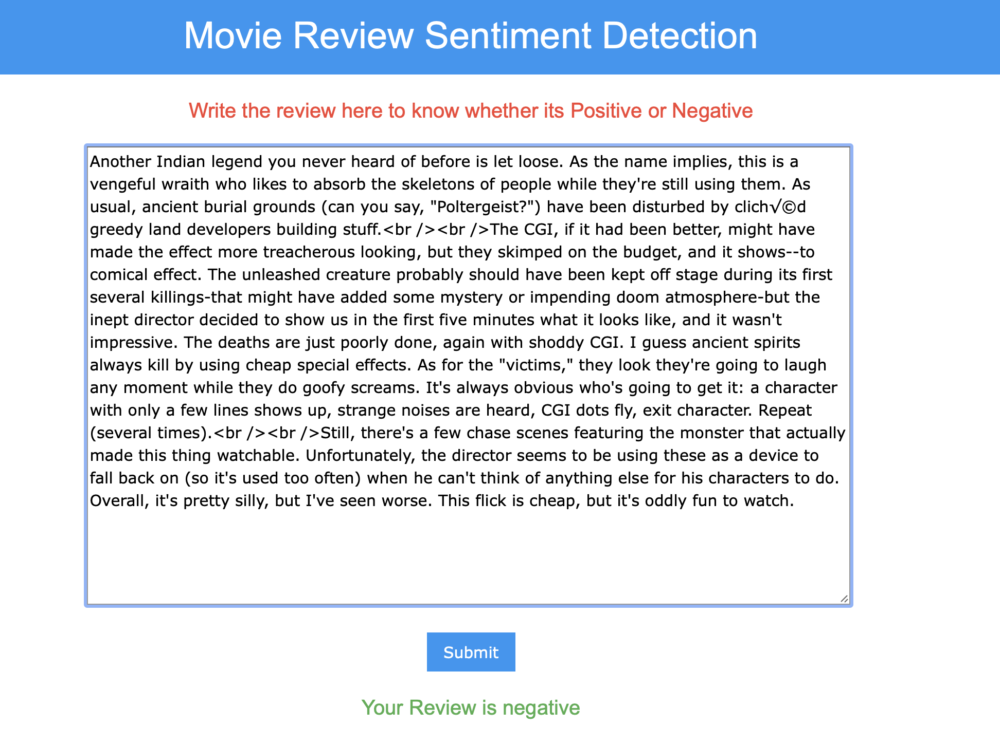

# Sentiment-analysis-with-movie-review

For Web demo on heroku : [click here](http://reviewdetector.herokuapp.com)
For Web demo on Azure  : [click here](https://reviewsenti.azurewebsites.net)

Detailed Report: **See ML_report.pdf**

For using locally :<br>
1. Install all dependencies mentioned in **requirement.txt**
2. Or use the dependincies from the environment by activating  the env folder by typing this command in cmd
> source env/bin/activate <br>
3. To run the Flask app run app.py
>python app.py

Demo and Screenshot :<br>

 
Positive
 
Negative
 

# Explanation


```python
# Importing the libraries
import numpy as np
import matplotlib.pyplot as plt
import pandas as pd
import glob
import os
from sklearn.utils import shuffle
# LIbrary to Clean the texts
import re
import nltk
from nltk.corpus import stopwords
from nltk.stem.porter import PorterStemmer
from nltk.stem import WordNetLemmatizer 
lemmatizer = WordNetLemmatizer() 
ps = PorterStemmer()
```

## Reading Train Data


```python
df=[]
for filename in glob.glob(os.path.join('train/pos/', '*.txt')):
    f = open(filename, 'r')
    content = f.read()
    df.append([content,1]) #1 stands for positive review
    
for filename in glob.glob(os.path.join('train/neg/', '*.txt')):
    f = open(filename, 'r')
    content = f.read()
    df.append([content,0]) #0 stands for negative review
    
train=pd.DataFrame(df)
train=train.sample(frac=1).reset_index(drop=True)
train.head()
```


<div>
<style scoped>
    .dataframe tbody tr th:only-of-type {
        vertical-align: middle;
    }

    .dataframe tbody tr th {
        vertical-align: top;
    }

    .dataframe thead th {
        text-align: right;
    }
</style>
<table border="1" class="dataframe">
  <thead>
    <tr style="text-align: right;">
      <th></th>
      <th>0</th>
      <th>1</th>
    </tr>
  </thead>
  <tbody>
    <tr>
      <th>0</th>
      <td>First of all, Jenna Jameson is the best actres...</td>
      <td>0</td>
    </tr>
    <tr>
      <th>1</th>
      <td>Once in a while in Indian cinema there comes a...</td>
      <td>0</td>
    </tr>
    <tr>
      <th>2</th>
      <td>I've just finished listening to the director's...</td>
      <td>1</td>
    </tr>
    <tr>
      <th>3</th>
      <td>This was surprisingly intelligent for a TV mov...</td>
      <td>1</td>
    </tr>
    <tr>
      <th>4</th>
      <td>This is one of the worst movies I saw! I dunno...</td>
      <td>0</td>
    </tr>
  </tbody>
</table>
</div>


## Reading Testing Data


```python
df=[]
for filename in glob.glob(os.path.join('test/pos/', '*.txt')):
    f = open(filename, 'r')
    content = f.read()
    df.append([content,1]) #1 stands for positive review
    
for filename in glob.glob(os.path.join('test/neg/', '*.txt')):
    f = open(filename, 'r')
    content = f.read()
    df.append([content,0]) #0 stands for negative review
    
test=pd.DataFrame(df)
test=test.sample(frac=1).reset_index(drop=True)
test.head()
```


<div>
<style scoped>
    .dataframe tbody tr th:only-of-type {
        vertical-align: middle;
    }

    .dataframe tbody tr th {
        vertical-align: top;
    }

    .dataframe thead th {
        text-align: right;
    }
</style>
<table border="1" class="dataframe">
  <thead>
    <tr style="text-align: right;">
      <th></th>
      <th>0</th>
      <th>1</th>
    </tr>
  </thead>
  <tbody>
    <tr>
      <th>0</th>
      <td>*** Spoiler in fifth paragraph *** This was an...</td>
      <td>1</td>
    </tr>
    <tr>
      <th>1</th>
      <td>This is a horrific re-make of the French movie...</td>
      <td>0</td>
    </tr>
    <tr>
      <th>2</th>
      <td>One of the Message Boards threads at IMDb had ...</td>
      <td>1</td>
    </tr>
    <tr>
      <th>3</th>
      <td>Life is too short to waste on two hours of Hol...</td>
      <td>0</td>
    </tr>
    <tr>
      <th>4</th>
      <td>This interesting lost film (written by Terence...</td>
      <td>1</td>
    </tr>
  </tbody>
</table>
</div>


## Cleaning the reviews


```python
 def remove_html_tags(text):
    """Remove html tags from a string"""
    clean = re.compile('<.*?>')
    return re.sub(clean, '', text)

def getCleanReview(review):
    review = remove_html_tags(review)
    #only keep alphabets remove rest
    review = re.sub('[^a-zA-Z]', ' ', review)
    #turn all reviews into lowercase
    review = review.lower()
    #remove stopwords and do stemming
    #review = [ps.stem(word) for word in review if not word in set(stopwords.words('english'))]
    #Lemmatize and merge the review together after making all the changes
    #review = ' '.join([lemmatizer.lemmatize(word) for word in review])
    return review
```


```python
X_train=train.iloc[:,0].values
Y_train=train.iloc[:,1].values
for i in range(len(X_train)):
    X_train[i]=getCleanReview(X_train[i])
    
#clean X_test as well 
X_test=test.iloc[:,0].values
Y_test=test.iloc[:,1].values

for i in range(len(X_test)):
    X_test[i]=getCleanReview(X_test[i])
```

# Naive bayes from scratch


```python
wordfreq={}
for review in X_train:
    words=review.split()
    for word in words:
        if word not in wordfreq.keys():
            wordfreq[word]=1
        else:
            wordfreq[word]+=1
len(wordfreq)
```


    74218


```python
#remove words with occurance less than 5 and remove stopwords
repeat=[]
for i in wordfreq.keys():
    if wordfreq[i] <5 :
        repeat.append(i)
    
for i in repeat:
    del wordfreq[i]

len(wordfreq)
```


    28757


## Drop the less frequent words from out training data


```python
def remove_extra_words(dataset,wordfreq):
    for index ,review in enumerate(dataset):
        cleanreview=[]
        for word in review.split():
            if word in wordfreq.keys():
                cleanreview.append(word)
        cleanreview=' '.join(cleanreview)
        dataset[index]=cleanreview
    return dataset

X_train=remove_extra_words(X_train,wordfreq)
```

### Functions required for naive bayes


```python
# number of documents containing the word
def Word_count(X,wordfreq):
    wordcount={}
    for word in wordfreq.keys():
        count=0
        for review in X:
            if word in review:
                count+=1
        wordcount[word]=count
    return wordcount

wordcount=Word_count(X_train,wordfreq)
```


```python
#occurance of the word in positive document
def Word_positive(X,Y,wordfreq):
    wordpositive={}
    for word in wordfreq.keys():
        count=0
        for index,review in enumerate(X):
            if word in review and Y[index]==1:
                count+=1
        wordpositive[word]=count
    return wordpositive

wordpositive=Word_positive(X_train,Y_train,wordfreq)
```


```python
#occurance of the word in negative document
def Word_negative(X,Y,wordfreq):
    wordnegative={}
    for word in wordfreq.keys():
        count=0
        for index,review in enumerate(X):
            if word in review and Y[index]==0:
                count+=1
        wordnegative[word]=count
    return wordnegative

wordnegative=Word_negative(X_train,Y_train,wordfreq)
```


```python
def total_sentiment(Y ,sentiment):
    length=0
    for i in Y:
        if i == sentiment:
            length+=1
    return length

def conditional_probability(X,Y,word,sentiment,length):
    if sentiment ==1:
        count=0 if word not in wordpositive.keys() else wordpositive[word]
    else:
        count=0 if word not in wordnegative.keys() else wordnegative[word]
    return count/length

def get_sentiment_probability(Y,sentiment):
    count=0
    for i in Y:
        if i==sentiment:
            count+=1
    return count/len(Y)

def calculateBayes(X,Y,word,sentiment,length):
    one=conditional_probability(X,Y,word,sentiment,length)
    two=length/len(Y) #probability of the sentiment
    three=calculate_probability_occurance(X,word)
    count=wordcount[word] if word in wordcount.keys() else 2
    return  (((one*two)+1)/(three+count))

def reviewSentiment(X,Y,review,sentiment):
    sum=1
    length = total_sentiment(Y_train ,1)
    for word in review.split():
        prob = calculateBayes(X,Y,word,sentiment,length)
        sum *= prob
    return sum

def naiveBayes(X,Y,review):
    #check if review sentiment is positive
    positive =reviewSentiment(X,Y,review,1)
    #check if review sentiment is negative
    negative =reviewSentiment(X,Y,review,0)
    if positive > negative:
        return 1
    else :
        return 0
    
def naiveBayes_onWhole(X,Y,x_test):
    ypred=[]
    for review in x_test:
        pred=naiveBayes(X,Y,review)
        ypred.append(pred)
    return ypred

def accuracy_metric(actual, predicted):
    correct = 0
    for i in range(len(actual)):
        if actual[i] == predicted[i]:
            correct += 1
    return correct / float(len(actual)) * 100.0

def calculate_probability_occurance(dataset,word):
    count= 0 if word not in wordcount.keys() else wordcount[word]
    return count/len(dataset)
```

## calculate accuracy on test Data


```python
X_test=remove_extra_words(X_test,wordfreq)
y_pred=naiveBayes_onWhole(X_train,Y_train,X_test)
score=accuracy_metric(Y_test, y_pred)
print('Accuracy By Naive Bayes from scratch on Test set : {} %'.format(score))
```

    Accuracy By Naive Bayes from scratch on Test set : 52.144 %


## Compare with Naive Bayes library from sklearn


```python
X_train=train.iloc[:,0].values
Y_train=train.iloc[:,1].values
for i in range(len(X_train)):
    X_train[i]=getCleanReview(X_train[i])
X_test=test.iloc[:,0].values
Y_test=test.iloc[:,1].values
for i in range(len(X_test)):
    X_test[i]=getCleanReview(X_test[i])
```


```python
#set up tfidfvectorizor
from sklearn.feature_extraction.text import TfidfVectorizer
tfidf_vectorizor=TfidfVectorizer(stop_words='english', max_df=0.7,max_features=10000)

#fit and transform train and test set
tfidf_train=tfidf_vectorizor.fit_transform(X_train).toarray()
tfidf_test=tfidf_vectorizor.transform(X_test).toarray()
tfidf_train.shape
```


    (25000, 10000)


```python
# Fitting Naive Bayes to the Training set
from sklearn.naive_bayes import GaussianNB
NaiveClassifier = GaussianNB()
NaiveClassifier.fit(tfidf_train, Y_train)

# Applying k-Fold Cross Validation
from sklearn.model_selection import cross_val_score
accuracies = cross_val_score(estimator = NaiveClassifier, X = tfidf_train, y = Y_train, cv = 10)
print('Accuracy By Naive Bayes using library on Test set : {} %'.format(accuracies.mean()*100))
```

    Accuracy By Naive Bayes using library on Test set : 78.46400000000001 %


```python
from sklearn.externals import joblib
#saving the model
joblib.dump(NaiveClassifier,'model/NaiveBayes_model.sav')
joblib.dump(tfidf_vectorizor,'model/tfidf_model.sav')
```

    /Users/elisontuscano/opt/anaconda3/lib/python3.7/site-packages/sklearn/externals/joblib/__init__.py:15: FutureWarning: sklearn.externals.joblib is deprecated in 0.21 and will be removed in 0.23. Please import this functionality directly from joblib, which can be installed with: pip install joblib. If this warning is raised when loading pickled models, you may need to re-serialize those models with scikit-learn 0.21+.
      warnings.warn(msg, category=FutureWarning)


    ['model/tfidf_model.sav']


## Comparison with Random Forest Algorithm


```python
from sklearn.ensemble import RandomForestClassifier
RFClassifier = RandomForestClassifier(n_estimators = 10, criterion = 'entropy', random_state = 0)
RFClassifier.fit(tfidf_train, Y_train)

# Applying k-Fold Cross Validation
accuracies = cross_val_score(estimator = RFClassifier, X = tfidf_train, y = Y_train, cv = 10)
print('Accuracy By Random Forest on Test set : {} %'.format(accuracies.mean()*100))
```

    Accuracy By Random Forest on Test set : 79.208 %


```python
#checking the accuracy on test data
accuracies = cross_val_score(estimator =RFClassifier, X = tfidf_test, y = Y_test, cv = 10)
accuracies.mean()
```


    0.7867999999999999


## Improvement with Artificial neural network


```python
# Importing the Keras libraries and packages
import keras
from keras.models import Sequential
from keras.layers import Dense

# Initialising the ANN
classifier = Sequential()
# Adding the input layer and the first hidden layer
classifier.add(Dense(output_dim = 256, init = 'uniform', activation = 'relu', input_dim = 10000))
# Adding the second hidden layer
classifier.add(Dense(output_dim = 64, init = 'uniform', activation = 'relu'))
# Adding the output layer
classifier.add(Dense(output_dim = 1, init = 'uniform', activation = 'sigmoid'))
# Compiling the ANN
classifier.compile(optimizer = 'adam', loss = 'binary_crossentropy', metrics = ['accuracy'])
# Fitting the ANN to the Training set
classifier.fit(tfidf_train, Y_train, batch_size = 10, nb_epoch = 5,validation_data=(tfidf_test,Y_test))
```

    Using TensorFlow backend.
    /Users/elisontuscano/opt/anaconda3/lib/python3.7/site-packages/ipykernel_launcher.py:9: UserWarning: Update your `Dense` call to the Keras 2 API: `Dense(activation="relu", input_dim=10000, units=256, kernel_initializer="uniform")`
      if __name__ == '__main__':
    /Users/elisontuscano/opt/anaconda3/lib/python3.7/site-packages/ipykernel_launcher.py:11: UserWarning: Update your `Dense` call to the Keras 2 API: `Dense(activation="relu", units=64, kernel_initializer="uniform")`
      # This is added back by InteractiveShellApp.init_path()
    /Users/elisontuscano/opt/anaconda3/lib/python3.7/site-packages/ipykernel_launcher.py:13: UserWarning: Update your `Dense` call to the Keras 2 API: `Dense(activation="sigmoid", units=1, kernel_initializer="uniform")`
      del sys.path[0]
    /Users/elisontuscano/opt/anaconda3/lib/python3.7/site-packages/ipykernel_launcher.py:17: UserWarning: The `nb_epoch` argument in `fit` has been renamed `epochs`.


    Train on 25000 samples, validate on 25000 samples
    Epoch 1/5
    25000/25000 [==============================] - 45s 2ms/step - loss: 0.3178 - accuracy: 0.8635 - val_loss: 0.3194 - val_accuracy: 0.8625
    Epoch 2/5
    25000/25000 [==============================] - 59s 2ms/step - loss: 0.1618 - accuracy: 0.9365 - val_loss: 0.3725 - val_accuracy: 0.8584
    Epoch 3/5
    25000/25000 [==============================] - 51s 2ms/step - loss: 0.0623 - accuracy: 0.9764 - val_loss: 0.6043 - val_accuracy: 0.8516
    Epoch 4/5
    25000/25000 [==============================] - 47s 2ms/step - loss: 0.0129 - accuracy: 0.9940 - val_loss: 1.1866 - val_accuracy: 0.8438
    Epoch 5/5
    25000/25000 [==============================] - 48s 2ms/step - loss: 0.0039 - accuracy: 0.9984 - val_loss: 1.4588 - val_accuracy: 0.8461


    <keras.callbacks.callbacks.History at 0x1b2986d650>


```python
classifier.save('model/ann_model.h5')
score = classifier.evaluate(tfidf_test, Y_test, verbose=0)
print('Test accuracy Using ANN: {} %'. format(score[1]*100))
```

    Test accuracy Using ANN: 84.61199998855591 %


```python

```

